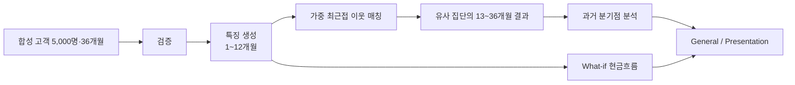
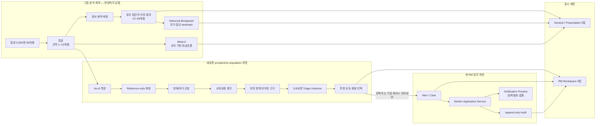
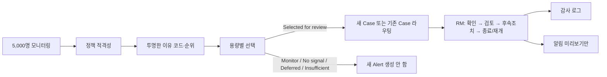

# Financial Path Twin — 현재 아키텍처와 피드백 대응 요약

> 기준일: 2026-08-24
>
> 비교 기준: GitHub `origin/main` = `c68c8cc` / Post-P0 feedback-readiness
> additions
> 핵심 결론: **P0의 5,000명 기반 RM 업무 프로토타입은 현재 GitHub main에
> 포함됩니다. Post-P0는 claims·governance·synthetic rehearsal readiness를
> 보강하지만, 실제 익명화 데이터 검증과 실제 RM pilot은 시작되지 않았습니다.**

## 1. 한눈에 보는 변화

| 구분 | 현재 GitHub main (P0) | Post-P0 feedback readiness |
| --- | --- | --- |
| 분석 단위 | 전체 5,000명 분석 + 개별 고객 화면 | canonical 분석은 변경하지 않음 |
| 경고 근거 | as-of 신호, 교차검증, historical/prospective 분리 | leakage/claim regression 및 timing copy 검토 |
| 고객 선택 | 정책 → 투명 순위 → triage → unbounded 또는 비교 capacity | 사람이 입력한 draft capacity 비교, 자동 승인 없음 |
| 은행 직원 흐름 | Alert/Case → 검토·조치 → 감사 로그 → offline Preview | 합성 dry-run과 pilot measurement protocol |
| 앱 화면 | General / Presentation 5탭 / RM Workspace 4탭 | 영상 제작은 코드 완료로 취급하지 않음 |
| 운영 연결 | 파일 기반 P0 prototype, DB·외부 발송 없음 | 실데이터 governance/adapter/metrics readiness만; actual data 없음 |

P0 구현은 `c68c8cc` GitHub main에서 확인할 수 있습니다. 12-17 이후의
working-tree changes는 별도 검토·commit·push 전까지 local feedback-readiness
evidence이며, GitHub release 상태와 혼동하지 않습니다.

## 2. 이전 GitHub 구조: “한 고객의 Twin 분석 데모”



- 강점: 최근 12개월만으로 유사 재무 궤적을 찾고, 그 집단의 이후 결과·과거 분기점·What-if를 설명합니다.
- 한계: 앱의 중심이 한 명의 대표 고객이며, 이 결과가 RM의 실제 업무 큐와 조치로 이어지지는 않았습니다.

## 3. 현재 로컬 구조: “분석 → 선택 → RM 업무 흐름”



### 반드시 지키는 의미 경계

```text
Historical Breakpoint = 유사 과거 집단이 갈라진 landmark
                         ≠ 현재 고객의 미래 위험 발생일

Historical outcome share = 유사 집단의 관측 결과 비중
                           ≠ 고객 개인의 prediction probability

What-if = 규칙 기반 현금흐름 비교
          ≠ 개입 효과·자동 금융 의사결정

Policy eligibility → Triage selection → Alert creation
      서로 다른 책임이며, policy만으로 Alert를 만들지 않음
```

## 4. 5,000명에서 RM 화면까지의 실제 흐름



현재 seed-42 산출물의 reconciliation은 다음과 같습니다.

| 단계 | 수 | 의미 |
| --- | ---: | --- |
| 모니터링 universe | 5,000 | 전체 합성 고객 |
| 정책 적격 / unbounded 데모 선택 | 1,522 | Priority Review 1,148 + Review 374 |
| Monitor | 371 | 업무 큐에 넣지 않음 |
| No actionable signal | 3,107 | 업무 큐에 넣지 않음 |
| 분석 실패 / 누락 | 0 | ID·funnel exact reconciliation |

`1,522명`은 **unbounded demo 정책의 결과**입니다. 실제 일일 RM 처리량이나 승인된 운영 threshold가 아닙니다. 실제 운영에서는 은행이 정한 용량 시나리오를 선택해야 합니다.

Breakpoint는 1,732명에서 historical landmark를 찾았고 3,268명은 비교 집단이 충분하지 않아 `insufficient_group_size`로 정직하게 반환했습니다. 후자는 오류나 누락이 아니라, 근거가 부족할 때 landmark를 주장하지 않는 안전장치입니다.

## 5. 평가 피드백 대응도

| 평가 피드백 | 현재 준비도 | 근거 | 남은 일 |
| --- | --- | --- | --- |
| 전체 5,000명 분석·검증 필요 | **합성 PoC 기준 충족** | 5,000/5,000 성공, 고객 ID exact reconciliation, 고객별 200명 매칭 | 익명화 실제 데이터, 거버넌스, 외부 검증은 미구현 |
| 합성 label의 순환성 검증 | **강함** | validation-only permutation에서 원본 landmark 61/61, permutation 0/61 | 실제 데이터에서의 재검증 필요 |
| 한 명 데모 한계 | **상당 부분 해소** | population funnel, deterministic 대표 cohort, RM Portfolio가 5,000명부터 시작 | Presentation 기본 화면은 여전히 단일 고객 story이므로 영상에서 RM 화면을 먼저 보여야 함 |
| Banker Workflow 추가 | **P0 프로토타입 구현** | triage → idempotent Alert/Case → banker action → audit → preview | DB, 실제 RM 시스템, 승인 정책, 외부 발송은 미구현 |
| 앱을 슬라이드보다 더 보여주기 | **앱 준비, 영상 미완성** | General·Presentation·RM Workspace와 테스트가 존재 | 화면 녹화 구성·리허설·배포 가능한 GitHub 반영 필요 |

## 6. 발표에서 보여줄 90초 제품 흐름

| 시간 | 화면 | 한 문장 메시지 |
| ---: | --- | --- |
| 0–15초 | RM Portfolio funnel | “5,000명을 먼저 보고, 사람은 이유가 있는 큐만 검토합니다.” |
| 15–35초 | Review Queue | “선택 순위·선정 이유·왜 지금인지가 행 단위로 남습니다.” |
| 35–60초 | Customer Review | “현재 신호, 유사 Twin 근거, 과거 landmark를 혼동 없이 분리합니다.” |
| 60–75초 | Action / Audit | “RM이 확인·검토·후속조치를 기록하면 case 상태와 감사 로그가 함께 바뀝니다.” |
| 75–90초 | 한계와 다음 단계 | “합성 PoC이며, 실제 익명화 데이터 검증과 운영 용량 승인이 다음 단계입니다.” |

권장 비중은 **앱 화면 60% / 분석·검증 방법 25% / 한계와 실제 데이터 roadmap 15%**입니다. Breakpoint는 “현재 고객의 예언”이 아니라 “유사 과거 집단의 비교 근거”라고 명확히 말합니다.

## 7. 신뢰성 증거와 출시 전 병목

| 항목 | 현재 증거 | 판정 |
| --- | --- | --- |
| Legacy 분석 계약 | 기존 계산식·CSV/JSON schema 유지 | 유지 |
| leakage 방지 | as-of, reference-only scaler, cross-fit scorer/evaluator 분리 | 구현·테스트됨 |
| workflow 안전성 | 중복 case 방지, stale-state guard, append-only audit | 구현·테스트됨 |
| 외부 의존성 | DB·SMTP·webhook·provider SDK 없음, Preview/Null만 | 의도된 P0 범위 |
| 회귀 | 12-16 직전 `pytest -q`: 459 passed | 12-17에서도 재검증 필요 |
| 사용자 실행 | 최근 import 오류를 구조 분리로 보완 | **영상 전 BAT 실기동 리허설 필요** |
| GitHub 재현성 | P0는 `c68c8cc` main에 포함 | Post-P0 작업은 검토·commit 전 local evidence |

## 8. 다음 우선순위

1. `03_run_app.bat`으로 clean environment의 General/Presentation/RM rehearsal을
   끝내고, 필요한 영상은 별도 human production task로 제작한다.
2. P0 이후 local feedback-readiness changes를 검토·commit·push하기 전에는
   GitHub release evidence라고 주장하지 않는다.
3. 별도 승인 후에만 secure environment의 anonymized-data validation을 검토한다.
   현재 repository의 governance/adapter/metric contract는 approval이나 real-data
   validation을 의미하지 않는다.
